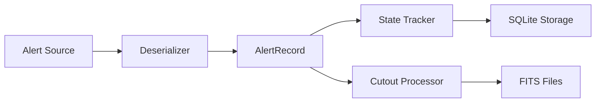

# Ingestion Pipeline

The ingestion pipeline fetches alerts from various sources and stores them in SQLite.

## Pipeline Overview



## Alert Sources

### ANTARES Source

The primary source for production use:

```python
from lsst_extendedness.sources import ANTARESSource

source = ANTARESSource(
    topics=["extragalactic_staging"],
    api_key="your-key",
    api_secret="your-secret",
)

with source:
    for alert in source.fetch_alerts(limit=1000):
        print(f"Alert {alert.alert_id}: RA={alert.ra}")
```

### Kafka Source

Direct Kafka access with AVRO deserialization:

```python
from lsst_extendedness.sources import KafkaSource

source = KafkaSource(
    bootstrap_servers="kafka.example.com:9092",
    topic="lsst-alerts",
    group_id="my-consumer",
)

with source:
    for alert in source.fetch_alerts(duration_seconds=3600):
        process(alert)
```

### File Source

Import historical data:

```python
from lsst_extendedness.sources import FileSource

# From CSV
source = FileSource(path="data/alerts.csv")

# From AVRO
source = FileSource(path="data/alerts.avro")

with source:
    alerts = list(source.fetch_alerts())
    print(f"Loaded {len(alerts)} alerts")
```

## Running Ingestion

### CLI

```bash
# From ANTARES
lsst-extendedness ingest --source antares --limit 10000

# From Kafka with duration
lsst-extendedness ingest --source kafka --duration 3600

# From file
lsst-extendedness ingest --source file --path data/alerts.csv

# Mock data for testing
lsst-extendedness ingest --source mock --count 1000
```

### Python API

```python
from lsst_extendedness.ingest import IngestionPipeline
from lsst_extendedness.sources import ANTARESSource
from lsst_extendedness.storage import SQLiteStorage

# Setup
source = ANTARESSource(...)
storage = SQLiteStorage("data/alerts.db")
storage.initialize()

# Create pipeline
pipeline = IngestionPipeline(source, storage)

# Run
run = pipeline.run(limit=10000)
print(f"Ingested {run.alerts_ingested} alerts")
print(f"New sources: {run.new_sources}")
print(f"Reassociations: {run.reassociations_detected}")
```

## Reassociation Detection

The pipeline tracks DIASources across observations to detect SSObject reassociations:

1. **New Association**: Source previously had no SSObject, now has one
2. **Changed Association**: Source moved to a different SSObject
3. **Updated Timestamp**: Reassociation timestamp changed

```python
# Access reassociation info
for alert in alerts:
    if alert.is_reassociation:
        print(f"Reassociation: {alert.reassociation_reason}")
        print(f"  SSObject: {alert.ss_object_id}")
```

## Cutout Extraction

FITS cutouts are automatically extracted and saved:

```python
from lsst_extendedness.cutouts import CutoutProcessor

processor = CutoutProcessor(output_dir="data/cutouts")

for alert in alerts:
    paths = processor.process(alert)
    print(f"Science: {paths.science}")
    print(f"Template: {paths.template}")
    print(f"Difference: {paths.difference}")
```

## State Management

Ingestion state is tracked in the database:

```sql
-- View ingestion runs
SELECT * FROM ingestion_runs ORDER BY started_at DESC LIMIT 10;

-- View processed sources
SELECT COUNT(*) FROM processed_sources;
```
